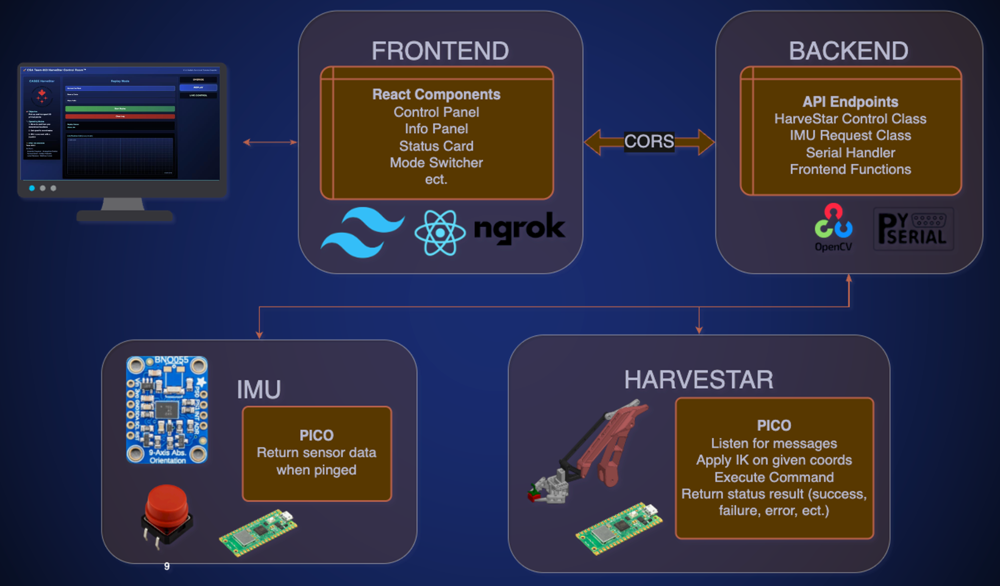

# HarveStar - Robotic Arm Control System

A web application for controlling an EEZYbotARM MK2 with real-time feedback and multiple control modes.



## System Overview

The HarveStar controll panel is a lightweight full-stack application that provides an interface for controlling the EEZYbotARM MK2. The system consists of:

- **Frontend**: React-based UI with real-time position tracking and multiple control modes
- **Backend**: Flask server handling API endpoints and serial communication
- **Hardware**: Robotic arm controlled by a Raspberry Pi Pico with IMU sensor integration (IMU code is seperate)

### Key Features

- Manual Control Mode with coordinate-based positioning
- Replay Mode for pre-programmed sequences
- Real-time position tracking and visualization
- Live camera feed integration
- IMU sensor data integration
- Responsive design for both desktop and mobile

## Project Structure

```
.
├── frontend-final/           # React frontend application
│   ├── src/
│   │   ├── components/      # React components
│   │   └── styles/         # CSS and styling
│   └── package.json        # Frontend dependencies
│
├── backend-clean/           # Flask backend server
│   ├── arm_controller/     # Arm control logic
│   ├── api/               # API endpoints
│   └── requirements.txt   # Python dependencies
│
└── hardware/              # Hardware-related code
    └── pico/             # Raspberry Pi Pico firmware
```

## Setup Instructions

### Prerequisites

- Node.js (v16+)
- Python (v3.8+)
- 2 Raspberry Pi Picos running CircuitPython (for HarveStar and IMU controller)
- Serial port access

### Frontend Setup

1. Navigate to the frontend directory:
   ```bash
   cd frontend-final
   ```

2. Install dependencies:
   ```bash
   npm install
   ```

3. Start the development server:
   ```bash
   npm run dev
   ```

### Backend Setup

1. Navigate to the backend directory:
   ```bash
   cd backend-clean
   ```

2. Create and activate a virtual environment:
   ```bash
   python -m venv venv
   source venv/bin/activate  # On Windows: venv\Scripts\activate
   ```

3. Install dependencies:
   ```bash
   pip install -r requirements.txt
   ```

4. Start the Flask server:
   ```bash
   python app.py
   ```

## Usage

### Manual Control Mode
- Input X, Y, Z coordinates and effector angle
- HarveStar will reject "out of bound" coordinates

### Replay Mode
- Select from pre-programmed sequences:
  - Harvest the Plant
  - Draw a Circle (Sequence must be added)
  - Wave Hello (Sequence must be added)
- Real-time position tracking on the grid
- Status updates and error handling

## Architecture

The system follows a client-server architecture:

1. **Frontend Components**
   - Control Panel for manual input
   - Info Panel for system status
   - Status Card for feedback
   - Mode Switcher for control modes

2. **Backend Services**
   - HarveStar Control Class
   - IMU Request Handler
   - Serial Communication Handler
   - Frontend API Functions

3. **Hardware Integration**
   - Raspberry Pi Pico firmware
   - IMU sensor integration
   - Serial communication protocol

## Technologies Used

- **Frontend**:
  - React
  - Tailwind CSS
  - Framer Motion
  - ngrok for tunneling

- **Backend**:
  - Flask
  - OpenCV
  - PySerial
  - CORS support

- **Hardware**:
  - Raspberry Pi Pico
  - IMU sensor
  - Custom servo controls


